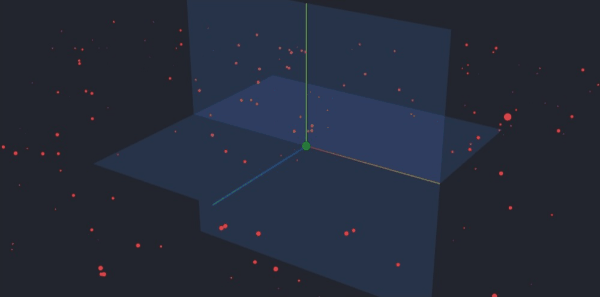

# WebGL Gravity Simulation

Deployed application: [https://nbody-gravity-webgl.vercel.app/](https://nbody-gravity-webgl.vercel.app/)

This is a WebGL Gravity and n-body simulation built using three.js. It is very much a work-in-progress, and currently consists of:

- A JavaScript application that uses the equation for universal gravitation applied to three.js objects.

In the future, I would like this simulation to include:

- A n-body simulation that allows for millions of particles
- A more efficient algorithm to compute gravitation, such as Barnes-Hut. Right now the sim runs at $O(n^2)$
- Computation moved to a compute shader
- Expanded UI

**Build a development enviroment**

The application uses [vite](https://vitejs.dev/)

```bash
npm install
npm run dev
```

**2. Refrences**

The following sources helped me build this:

- [Bruno Simon's awesome course on three.js](https://threejs-journey.com/)
- [The Coding Train's videos on mutual attraction and gravitation](https://www.youtube.com/watch?v=GjbKsOkN1Oc&t=152s)

Thank you to every developer that takes the time to make quality content!

